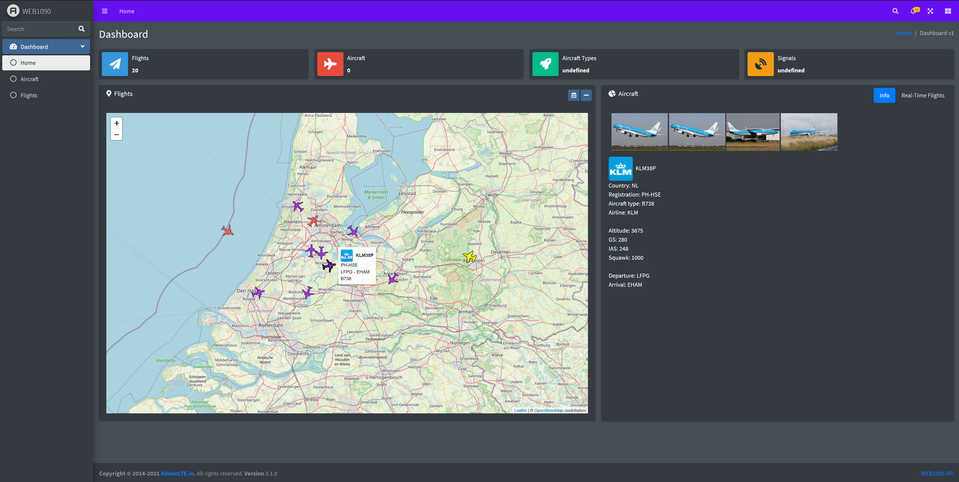

# WEB1090

WEB1090 serves as a dashboard for your ADS-B data. It stores data from DUMP1090 in a PostgreSQL database and displays the data via an API and frontend to the user.

The frontend is based on the AdminLTE template. The API is based on FastAPI.

## Data
The data is fetched from multiple sources. The (web) APIs used are:
* [AviationStack](https://aviationstack.com/documentation): Aircraft and route information
* [FlightAware's tools](https://github.com/flightaware/dump1090/tree/master/tools): Aircraft information
* [VirtualRadar](https://www.virtualradarserver.co.uk/FlightRoutes.aspx): Route information
* [Airport-Data](https://www.airport-data.com): Aircraft images
* [Kiwi.com](https://images.kiwi.com): Airline logos
* [dump1090-fa](https://github.com/adsbxchange/dump1090-fa): Real-time aircraft tracking by use of ADS-B
* [Schiphol flights API](https://developer.schiphol.nl/apis/flight-api/): Real-time flight information for in/outbound flights to/from Schiphol
* [Google custom search API](https://programmablesearchengine.google.com/about/): Route information by ICAO flight number lookup

The data fetched from these sources are used for personal use only.
The code is written to minimze the load on these APIs.
